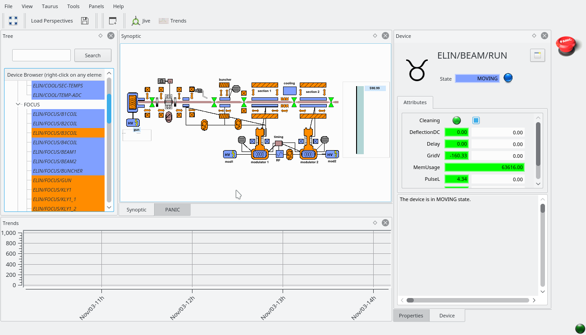

Execute the ELinac simulation
=============================

REQUISITES: PyTango, Taurus and a Tango Database must be installed.

In addition, get latest fandango and SimulatorDS::

  > git clone -b develop https://github.com/tango-controls/fandango fandango.git
  > git clone -b develop https://github.com/tango-controls/SimulatorDS
  
Install them using setup.py or just add folders to PATH::

  > export PYTHONPATH=$(pwd):$(pwd)/fandango.git:$PYTHONPATH
  > export PATH=$(pwd)/fandango.git/fandango/scripts:$PATH 

Get Vacca::

  > git clone -b develop https://github.com/tango-controls/vacca vacca.git
  > export PATH=$(pwd)/vacca.git/bin:$PATH
  > export PYTHONPATH=$(pwd)/vacca.git:$PYTHONPATH
  > cd vacca.git/examples/elinac

If you don't have the TangoBox devices, create new simulators using SimulatorDS ::

  > ipython
  : import SimulatorDS.gen_simulation as gs
  : gs.generate_class_properties(all_rw=True)
  : host = gs.fandango.get_tango_host().split(':')[0]
  : gs.create_simulators('ui_attribute_values.pck',instance='elinac',tango_host=host)
  # Press "yes" when asked to override properties. 
  : Ctrl+D

Launch the simulators using DynamicDS script::

 > DynamicDS elinac >/dev/null &
 
Check that they started properly::

 >  tango_servers states DynamicDS/elinac

Last, launch VACCA::

  > vaccagui elinac.py

Depending on your OS version you may get some QString exceptions at startup; just click on "Ignore" as these messages will appear only the first time you execute the application.

From this point you can select devices from the tree or synoptic, plot values, interact with attributes/commands or start/stop/reload devices and its properties using the right click menus. You can use the properties panel to edit the values of the attributes as you wish; use right-click or the updateDynamicAttributes command to update the simulated values.

If panic and PyTangoArchiving are available, the AlarmGUI and ArchivingBrowser widgets can be added to the perspective for a richer functionality.

Sergi Rubio, 2010 - 2016
